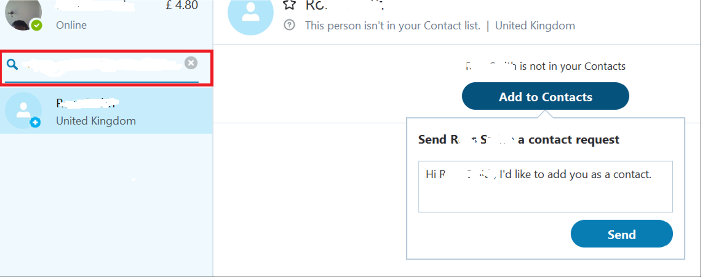
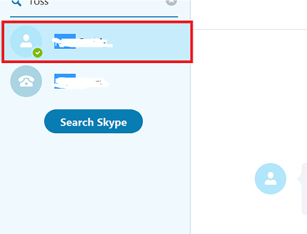
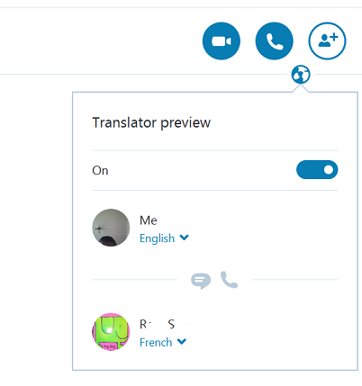

# Skype Translator and the Translation APIs
Break down language barriers with your friends, family and colleagues. Skype translator can help you communicate in 8 languages for voice calls, and in more than 50 languages while instant messaging. This is currently in preview and uses the Translation APIs (also part of the demo) which are part of Cognitive services.

Technologies: **Skype Desktop and the Translation APIs**

Technical Depth: **Anyone**

Time: **5-10 minutes**

Software: **Skype**

Hardware: **Headset is likely to be needed to reduce the impact of ambient noise**

Video: **[SKYPE ST FINAL-HD.mp4](SKYPE ST FINAL-HD.mp4)**
 
Demo Notes: **Note that this demo requires 2 people to be logged into Skype - one of whom speaks one of the 8 languages supported for voice calls (English, French, German, Arabic, Chinese
, Italian, Portuguese, Russian and Spanish)**

Accounts: **FDStand2016@outlook.com** (password is **FutureDecoded2016**) - TBC Specific Accounts for Skype demo

## Use Skype for Desktop
1. Each user will need to log on to different machines and start Skype - in order to contact one use will need to search for the user other as shown below, then click 'Add to Contacts' and then 'send'  
  

2. click on the contact you wish to communicate with:  
  

3. Select the globe symbol - turn on the translator and then select the 2 languages you want to use:  
  

## Use Skype Translation
Note that if you use the live speech translation the demo will be affected by the background noise and language ability of the speaker. If necessary use the custom application Demo which uses the same translation APIs and will play back translation to a single user.

**Japanese Messaging Examples**
Spoken Japanese is not supported but you can use the messaging window to communicate:  
  • [lets try Japanese = 日本語を試すことができます。]("http://www.bing.com/translator/?ref=TThis&text=lets%20try%20Japanese&from=en&to=ja")  
  • [this is the best demo = これは、最高のデモ]("http://www.bing.com/translator/?ref=TThis&text=this%20is%20the%20best%20demo&from=en&to=ja")  
  • [Where is the cream? = クリームはどこですか]("http://www.bing.com/translator/?ref=TThis&text=where%20is%20the%20cream?&from=en&to=ja")  
  • [How much is this? = これはいくらですか。]("http://www.bing.com/translator/?ref=TThis&text=How%20much%20is%20this?&from=en&to=ja")  

If you have a good foreign language speaker and the environment is quiet enough you might want to demo live speech translation. Otherwise use the custom application below or play the video above.  
**French Examples might include for live speech translation**  
	• Bonjour, comment vas-tu  
  • [Mon nom est Robin = My Name is Robin]("https://www.bing.com/translator/?ref=TThis&text=my%20name%20is%20robin&from=en&to=fr")  
  • [A quelle heure appelez-vous cela ? = What time do you call this?]("https://www.bing.com/translator/?ref=TThis&text=what%20time%20do%20you%20call%20this?&from=en&to=fr")  
  • [J’ai l’amour avenir décodé = I love Future Decoded]("https://www.bing.com/translator/?ref=TThis&text=I%20love%20future%20decoded&from=en&to=fr")  
  • [Pouvez-vous traduire cela pour moi ?]("https://www.bing.com/translator/?ref=TThis&text=Can%20you%20translate%20this%20for%20me?&from=en&to=fr")  
  
## Use the Translation APIs in a Custom App - like Skype
This demo builds on the previous Skype demo - it shows the use of the same Speech Translation APIs that Skype uses but used in a custom application. This demo is more suitable where you only have one person to demo the translation APIs to or when there is difficult to organise a 2 person demo.  
**[Extract this Zip and then install the SpeechTranslator.Application file](SpeechTranslator.zip)**

If the application is working correctly you will see a screen like the following:  
  

**Translating Speach into Text**  

	1) Time to practice your other languages again ! - when you are ready to speak click the 'Start' button and speak.  
		○ Practice speaking a foreign language and see what English it comes up with.  
		○ Speak english and see it translate into a foreign language  
  2) Turn on TTS (Text to speech) and run the same examples as before - you will hear the language being Spoken. Note that not all languages currently support spoken language.  

---

**API Information**